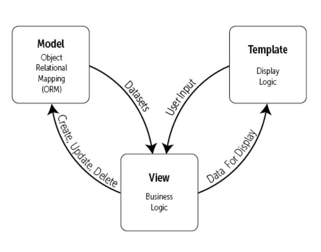
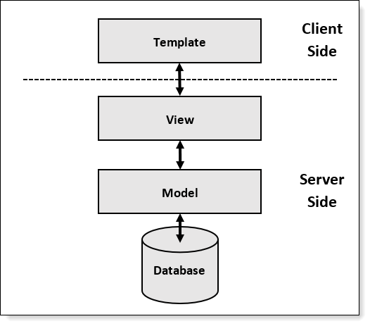
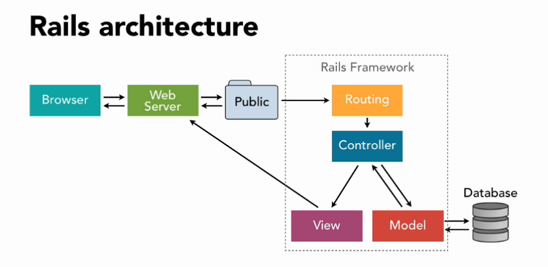

# Краткий обзор вебинара
- Как устроен Django
- Как настраивать окружение (.env, credentials)
- Подключаем не-public PostgreSQL-схемы
- Способы наследования моделей
- Модели по данным, которыми мы не управляем

<br><br><br><br><br><br>

# Как устроен Django


Ниже, в той же статье:


*Model-Template-Views?*

*Model-View-Controller?*

WTF?!






<br><br>

## А где в чистом виде реализован MVC и как выглядит этот ваш контроллер?



В Ruby on Rails контроллер - это класс, который объединяет множество вьюх. И называется соответствующе, Controller.
Важно понимать, что это не принципиально другая архитектура, а просто немного другой способ делать то же самое, что делает Django — группировать бизнес-логику по смыслу.

```ruby
class BookController < ApplicationController
   def list
   end
   
   def create
   end
   
   def delete
   end
   
end
```

Аналогичный код в Django:

```python
# books/views.py

def list_(request):
    ...

def create(request):
    ...

def delete(request):
    ...       
```


[Вот что Django Docs говорит про себя и MVC](https://docs.djangoproject.com/en/3.1/faq/general/#django-appears-to-be-a-mvc-framework-but-you-call-the-controller-the-view-and-the-view-the-template-how-come-you-don-t-use-the-standard-names)


<br><br><br><br><br><br>


# Как настраивать окружение (.env, credentials)

## settings/dev.py или dev.env?
Всё вместе 🙂

<br><br>

## Как запускать Django, если в settings используются переменные окружения

Прямолинейный вариант:
```bash
DB_NAME=postgres \
DB_USER=postgres \
DB_HOST=localhost \
DB_PORT=5432 \
DB_PASSWORD=mysecretpassword \
python3.9 santa_workshop/manage.py runserver
```

Можно сохранить вызов выше в bash-скрипт и вызывать его.

Еще один вариант - использовать Makefile.

Но лучший способ - запускать сервер с модулем [dotenv](https://pypi.org/project/python-dotenv/).

Вот так при помощи одной переменной можно переключать окружения:
```bash
ENV=dev python3.9 santa_workshop/manage.py runserver
```

<br><br><br><br><br><br>


# Подключаем не-public PostgreSQL-схемы

**Главный вопрос**: можно ли прописать схему (через роутер или в db_name) и навсегда забыть об этом?


**Ответ**: [нет](https://stackoverflow.com/questions/35609509/django-migrations-with-multiple-databases) 😔

Действительно, если не указать ключ `--database`, то `manage.py migrate` всегда будет использовать дефолтную базу. [Пруф](https://docs.djangoproject.com/en/3.1/topics/db/multi-db/#synchronizing-your-databases)


<br><br><br><br><br><br>


# Способы наследования моделей

1. На основе абстрактной модели:

```python
class Elf(models.Model):
    name = models.CharField(max_length=150)
    email = models.EmailField()

    class Meta:
        abstact = True


class Courier(Elf):
    country = models.CharField(max_length=150)

    class Meta:
        db_table = 'couriers'
```

Цель: не дублировать поля и логику в методах.

2. Расширение исходной модели:

```python
class Elf(models.Model):
    name = models.CharField(max_length=150)
    email = models.EmailField()

    class Meta:
        db_table = 'elves'


class Courier(Elf):
    country = models.CharField(max_length=150)

    class Meta:
        db_table = 'couriers'
```

Цель: работать и с обобщающей сущностью, и с разновидностями.